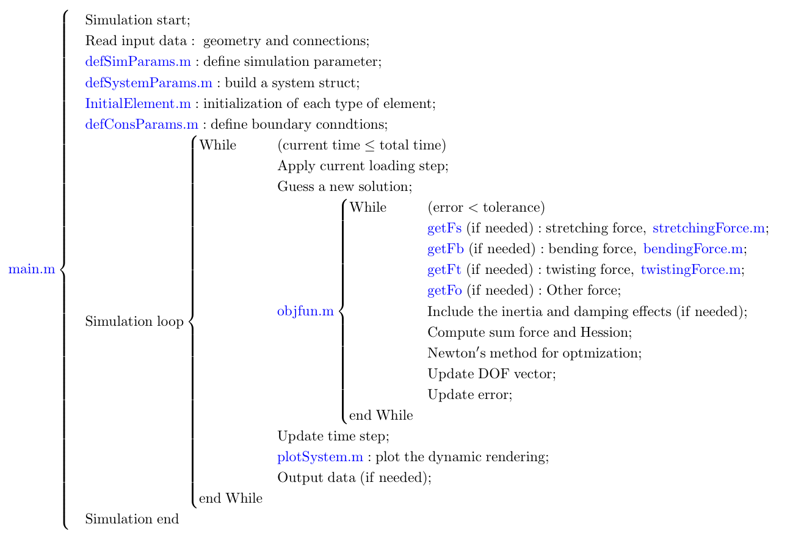

# Advanced Topics ⚡
Deep dive into advanced features.

---
title: "Advanced Topics"
nav_order: 3
layout: home
---

# Advanced Topics ⚡
Deep dive into advanced features.

## MATLAB Implementation

The overall numerical algorithms can be found in the figure below, and the detailed explanations for each MATLAB file are as follows:

### MATLAB Files:

1. **main.m**: Main function, including reading inputs, building structs, and performing simulation.
2. **defSimParams.m**: Define the numerical parameters for the simulation.
3. **defSystemParams.m**: Build a struct for the simulated system, e.g., beam, rod, or plate.
4. **InitialElement.m**: The initialization of each type of element, e.g., stretching elements.
5. **defConsParams.m**: Define boundary conditions for the simulation.
6. **objfun.m**: Update the time step by Euler method and optimize the solution by Newton's method.
7. **getForce.m**: Loop over all elements to build the global force vector and global session matrix.
8. **elasticForce.m**: Detailed formulation for the local force vector and local Hessian matrix.
9. **plotSystem.m**: Plot dynamic rendering for the numerical results.

