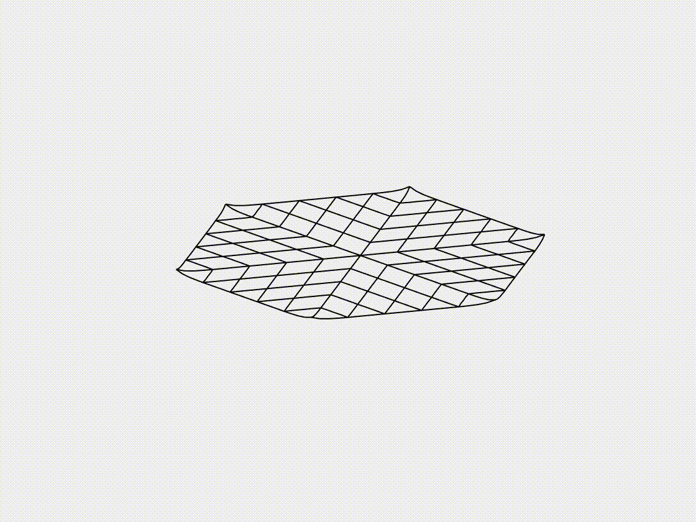
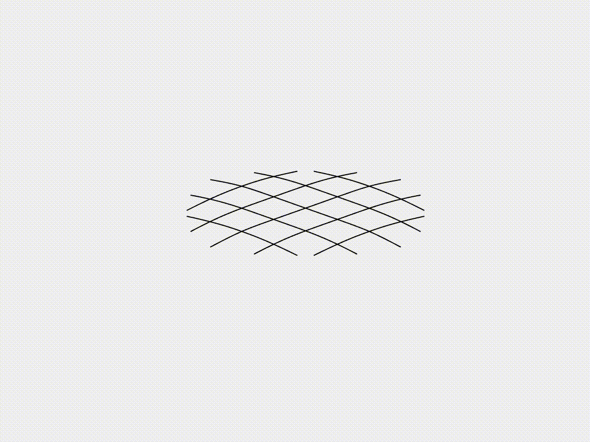
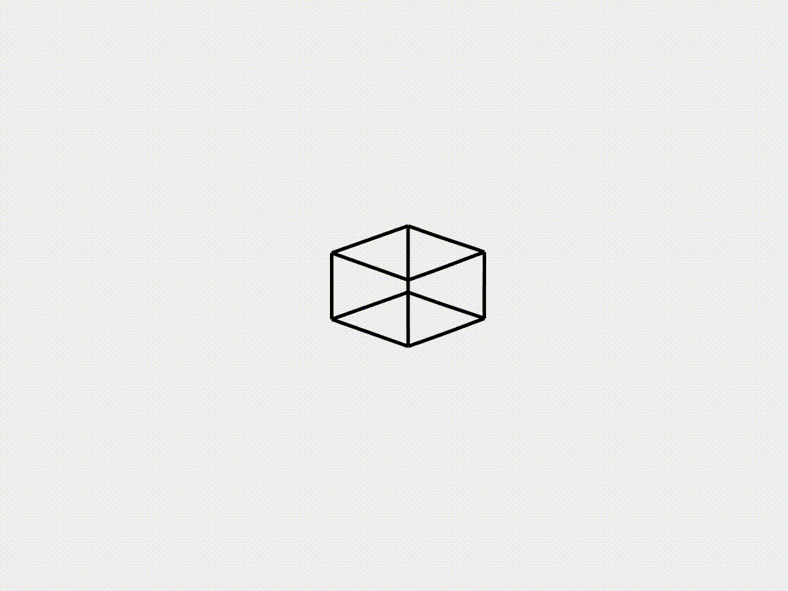
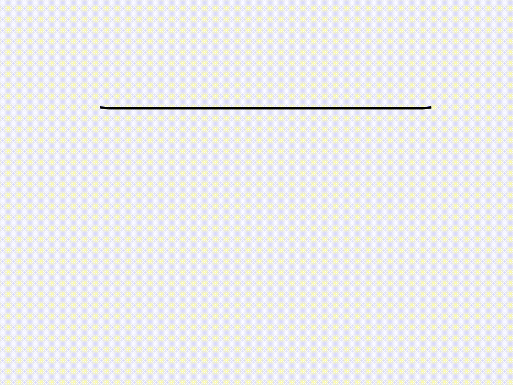
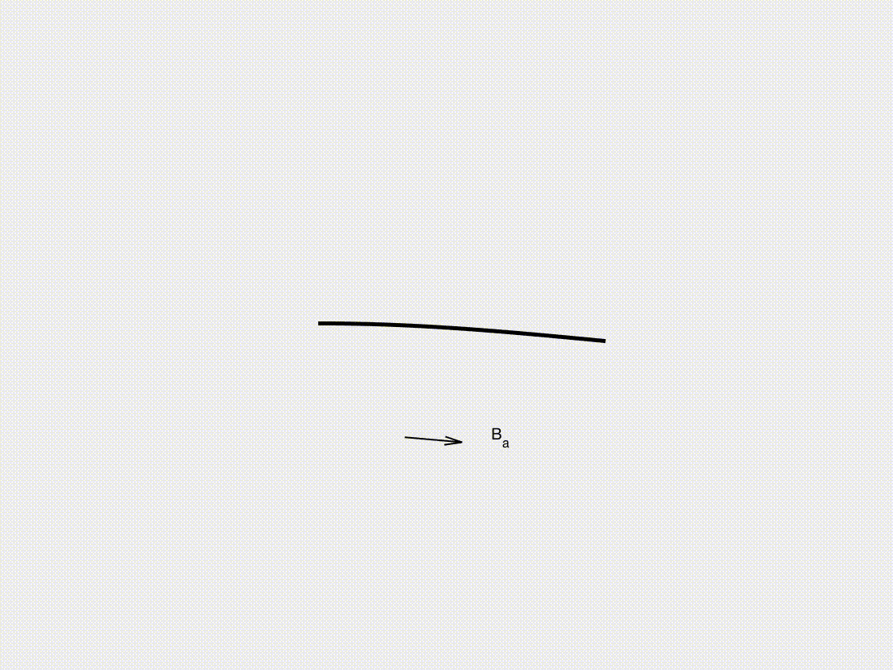

## Net under gravity
 

## Buckling-induced form-finding of gridshell
 

## Lattice structure under gravity
 

## Hyperelastic cable under vertical loading
 

## Snapping of a hyperelastic torus
 

## Beam under magnetic actuation
 

## Soft swimming robot
 

## Soft crawling robot
 
