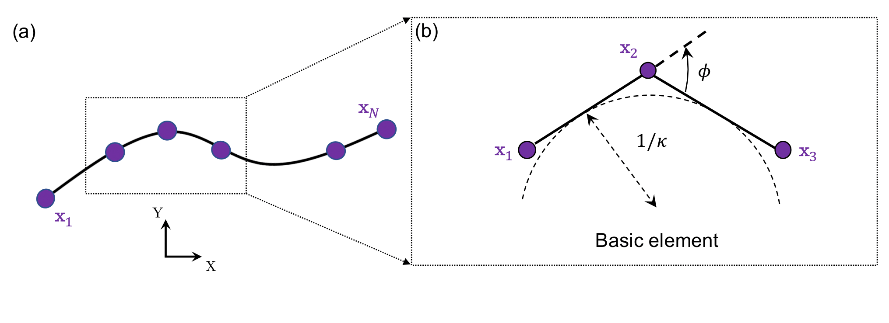

# Beam: planar curve

As shown in the figure above, the configuration of a planar beam is described by $$N$$ nodes, where each node is defined as $$\mathbf{x}_{i} \equiv [x_{i}, y_{i}]^{T} \in \mathcal{R}^{2 \times 1}$$. Therefore, the DOF vector can be expressed as:

$$
\mathbf{q} = \left[ \mathbf{x}_1; \mathbf{x}_2; \ldots; {\mathbf{x}_{N}} \right] \in \mathcal{R}^{2N \times 1}.
$$

Two types of elements are used to capture the total elastic energies of a discrete planar beam: (i) stretching element and (ii) bending element, with $$N_{s}$$ and $$N_{b}$$ representing the number of each, respectively. Note that if only the stretching element is considered, the bending-dominated beam structures would reduce to the stretching-dominated cable structures.

 

### Stretching element

The stretching element is comprised of two connected nodes, defined as:

$$
\mathcal{S}: \{\mathbf{x}_{1}, \mathbf{x}_{2} \}.
$$

Hereafter, we omit the subscript $$i$$ for simplicity. The local DOF vector of the stretching element is defined as:

$$
\mathbf{q}^{s} \equiv [\mathbf{x}_{1}; \mathbf{x}_{2} ] \in \mathcal{R}^{4 \times 1}.
$$

The edge length is the $$\mathcal{L}_{2}$$ norm of the edge vector, defined as:

$$
l = || \mathbf{x}_{2} - \mathbf{x}_{1} ||.
$$

The stretching strain is based on the uniaxial elongation of the edge, defined as:

$$
{\varepsilon} = \frac{l}{\bar{l}} - 1.
$$

Using the linear elastic model, the total stretching energy is expressed as a quadratic function of the strain:

$$
E^s = \frac{1}{2} EA (\varepsilon)^2 \bar{l},
$$

where $$EA$$ is the local stretching stiffness.

The local stretching force vector and Hessian matrix can be derived through a variational approach:

$$
\mathbf{F}^{s}_{\mathrm{local}} = -\frac{\partial E^{s}}{\partial \mathbf{q}^{s}}, \quad \mathbb{K}^{s}_{\mathrm{local}} = \frac{\partial^2 E^{s}}{\partial \mathbf{q}^{s} \partial \mathbf{q}^{s}}.
$$

The detailed formulation can be found in the MATLAB code. Finally, the global stretching force vector,  $$\mathbf{F}^{s}$$, and the associated Hessian matrix, $$\mathbb{K}^{s}$$, can be assembled by iterating over all stretching elements. 

### Bending element

Similarly, the bending element consists of two consecutive edges sharing a common node:

$$
\mathcal{B}: \{ \mathcal{S}_{1}, \mathcal{S}_{2}\}, \quad \mathcal{S}_{1} : \{ \mathbf{x}_{1}, \mathbf{x}_{2} \}, \quad \mathcal{S}_{2} : \{ \mathbf{x}_{2}, \mathbf{x}_{3} \}.
$$

The local DOF vector is:

$$
\mathbf{q}^{b} \equiv [\mathbf{x}_{1}; \mathbf{x}_{2}; \mathbf{x}_{3} ] \in \mathcal{R}^{6 \times 1}.
$$

The two edge vectors are:

$$
\mathbf{e}_{1} = \mathbf{x}_{2} - \mathbf{x}_{1}, \quad \mathbf{e}_{2} = \mathbf{x}_{3} - \mathbf{x}_{2}.
$$

The Voronoi length of the bending element is:

$$
l = \frac{1}{2} \left( || \mathbf{e}_{1} || + || \mathbf{e}_{2} || \right).
$$

The bending curvature is associated with the turning angle between the two connecting edges:

$$
{\kappa} = \frac{2 \tan \left( \frac{\phi}{2} \right)}{l}.
$$

The discrete bending energy is given by:

$$
E^{b} = \frac{1}{2} EI (\kappa - \bar{\kappa})^2 \bar{l},
$$

where $$EI$$ represents the local bending stiffness.

The local bending force vector and Hessian matrix are derived using a variational approach:

$$
\mathbf{F}^{b}_{\mathrm{local}} = -\frac{\partial E^{b}}{\partial \mathbf{q}^{b}}, \quad \mathbb{K}^{b}_{\mathrm{local}} = \frac{\partial^2 E^{b}}{\partial \mathbf{q}^{b} \partial \mathbf{q}^{b}}.
$$

The detailed formulation can be found in the MATLAB code.  Finally, the global bending force vector,  $$\mathbf{F}^{b}$$, and the associated Hessian, $$\mathbb{K}^{b}$$, can be assembled by iterating over all stretching elements. 

## Examples

- [Case 1: Beam deflection under gravity](../examples/2d_curve_case_1.html)
- [Case 2: Buckling of a beam under compression](../examples/2d_curve_case_2.html)
- [Case 3: Snapping of a pre-buckled beam](../examples/2d_curve_case_3.html)
