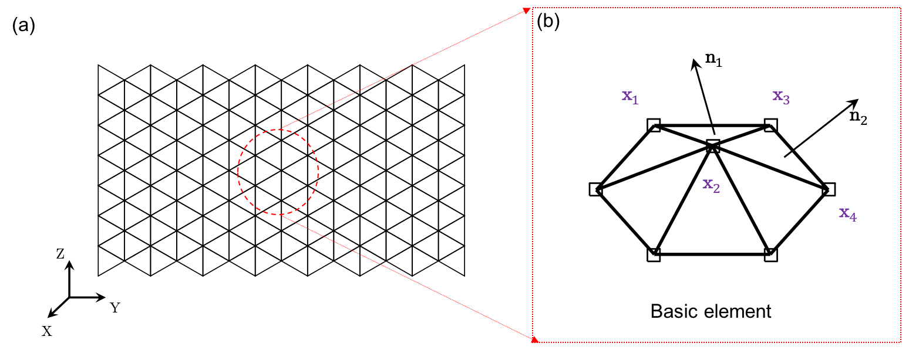

# Plate and shell: 3D surface

As shown in the figure below, the configuration of a 3D surface is represented by $$N$$ nodes, where each node is defined as $$\mathbf{x}_{i} \equiv [x_{i}, y_{i}, z_{i}]^{T} \in \mathcal{R}^{3 \times 1}$$. Thus, the total DOF vector is given by

$$
\mathbf{q} = [ \mathbf{x}_1; \mathbf{x}_2; \ldots; {\mathbf{x}_{N}} ] \in \mathcal{R}^{3N \times 1}.
$$

Two types of elements are used to capture the mechanics of a 3D surface: (i) stretching element, and (ii) bending element. The number of stretching elements is denoted as $$N_{s}$$, while the number of bending elements is denoted as $$N_{b}$$. If only the stretching elements are considered, bending-dominated plate/shell structures will be reduced to stretching-dominated membrane structures. 

 

### Stretching element

The stretching element is comprised of two connected nodes, defined as

$$
\mathcal{S}: \{\mathbf{x}_{1}, \mathbf{x}_{2} \}.
$$

The local DOF vector is defined as 

$$
\mathbf{q}^{s} \equiv [\mathbf{x}_{1}; \mathbf{x}_{2} ] \in \mathcal{R}^{6 \times 1}.
$$

The edge length is the $$\mathcal{L}_{2}$$ norm of the edge vector, defined as

$$
l   =  || \mathbf{x}_{2}  -\mathbf{x}_{1} ||.
$$

The stretching strain is based on the uniaxial elongation of the edge, defined as

$$
{\varepsilon} = {  l } - \bar{l}.
$$

Hereafter, we use a bar on top to indicate the evaluation of the undeformed configuration, e.g., $$\bar{l}$$ is the edge length before deformation. Using the linear elastic model, the total stretching energy is in a quadratic form of the strain following the linear elastic constitutive law

$$
E^s = \frac{\sqrt{3}}{4} Eb ( \varepsilon )^2,
$$

where $$E $$ is Young's modulus and $$b$$ is the plate thickness. Note that the Poisson's ratio is intrinsically determined in this model and equals $$\nu=1/3$$ when the mesh is an equilateral triangle. The local stretching force vector, $$\mathbf{F}^{s}_{\mathrm{local}} \in \mathcal{R}^{6 \times 1}$$, as well as the local stretching Hessian matrix, $$\mathbb{K}^{s}_{\mathrm{local}} \in \mathcal{R}^{6 \times 6}$$, can be derived through a variational approach as

$$
\mathbf{F}^{s}_{\mathrm{local}} = -\frac{\partial E^{s}}  {\partial \mathbf{q}^{s}}, \; \mathrm{and} \; \mathbb{K}^{s}_{\mathrm{local}} = \frac {\partial^2 E^{s}}  {\partial \mathbf{q}^{s} \partial \mathbf{q}^{s}}.
$$

The detailed formulation can be found in the MATLAB code. Finally, the global stretching force vector,  $$\mathbf{F}^{s}$$, and the associated Hessian matrix, $$\mathbb{K}^{s}$$, can be assembled by iterating over all stretching elements.

### Bending element

Before constructing the bending element, we first introduce the triangular element used in 3D surface simulation. Each triangular element has $$3$$ vertices as

$$
\mathcal{T}: \{ \mathbf{x}_{1}, \mathbf{x}_{2}, \mathbf{x}_{3} \}.
$$

When two neighboring triangular elements share a common edge (i.e., two common nodes), a bending element is formed to capture the angular deviation between them as

$$
\mathcal{B}: \{ \mathcal{T}_{1}, \mathcal{T}_{2} \}, \; \mathrm{with} \; \mathcal{T}_{1} : \{ \mathbf{x}_{1}, \mathbf{x}_{2}, \mathbf{x}_{3} \} \; \mathrm{and} \; \mathcal{T}_{2} : \{ \mathbf{x}_{2}, \mathbf{x}_{3}, \mathbf{x}_{4} \},
$$

where $$\{ \mathbf{x}_{2} , \mathbf{x}_{3} \}$$ are the joint nodes, and $$\{ \mathbf{x}_{1}, \mathbf{x}_{4} \}$$ are the two other nodes. Therefore, the local DOF vector is defined as 

$$
\mathbf{q}^{b} \equiv [\mathbf{x}_{1}; \mathbf{x}_{2};\mathbf{x}_{3};\mathbf{x}_{4} ] \in \mathcal{R}^{12 \times 1}.
$$

The edge vectors are given by

$$
 \mathbf{e}_{1} = \mathbf{x}_{2}  -\mathbf{x}_{1}, \; \mathbf{e}_{2} = \mathbf{x}_{3}  -\mathbf{x}_{1}, \; \mathbf{e}_{3} = \mathbf{x}_{2}  -\mathbf{x}_{4}, \; \mathbf{e}_{4} = \mathbf{x}_{3}  -\mathbf{x}_{4}.
$$

Next, the surface normal vectors of two triangular meshes are given by

$$
\mathbf{n}_1  =  \frac {\mathbf{e}_{1} \times \mathbf{e}_{2}} { || \mathbf{e}_{1} \times \mathbf{e}_{2}||}, \; \mathbf{n}_2  =  \frac {\mathbf{e}_{3} \times \mathbf{e}_{4}} {|| \mathbf{e}_{3} \times \mathbf{e}_{4} ||}.
$$

The bending curvature is associated with the turning angle between the two connecting surfaces, which can be expressed as

$$
{\kappa} = || \mathbf{n}_{1} - \mathbf{n}_{2} ||.
$$

The discrete bending energy is given in a similar approach

$$
E^b = \frac{1}{12\sqrt{3}} Eb^3 (\kappa  - \bar{\kappa} )^2.
$$

The local bending force vector, $$\mathbf{F}^{b}_{\mathrm{local}} \in \mathcal{R}^{12 \times 1}$$, as well as the local bending Hessian matrix, $$\mathbb{K}^{s}_{\mathrm{local}} \in \mathcal{R}^{12 \times 12}$$, can be derived through a variational approach

$$
\mathbf{F}^{b}_{\mathrm{local}} = -\frac{\partial E^{b}}  {\partial \mathbf{q}^{b}}, \; \mathrm{and} \; \mathbb{K}^{b}_{\mathrm{local}} = \frac {\partial^2 E^{b}}  {\partial \mathbf{q}^{b} \partial \mathbf{q}^{b}}.
$$

The detailed formulation can be found in the MATLAB code. Finally, the global bending force vector,  $$\mathbf{F}^{b}$$, and the associated Hessian matrix, $$\mathbb{K}^{b}$$, can be assembled by iterating over all bending elements.

## Examples

- [Case 1: Plate deflection under gravity](../examples/3d_surface_case_1.html)
- [Case 2: Plate wrinkling under gravity](../examples/3d_surface_case_2.html)
- [Case 3: Indentation of a cylindrical shell](../examples/3d_surface_case_3.html)
