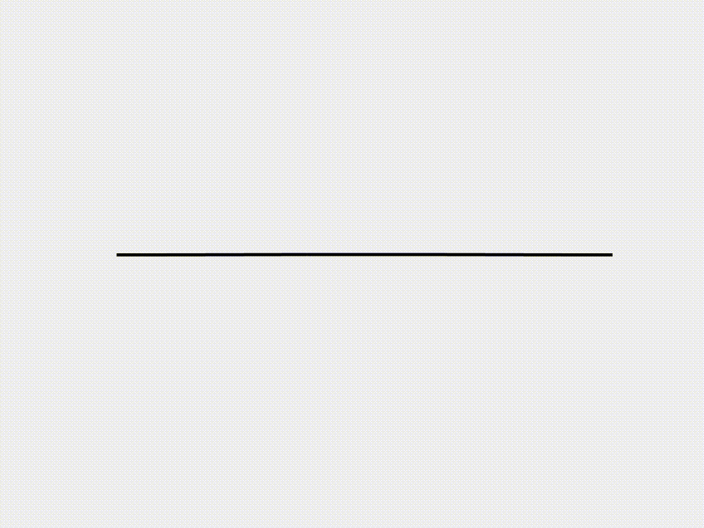

# Beam

## [Case 1: Beam deflection under gravity](2d_curve_case_1.html)
 

## [Case 2: Buckling of a compressive beam](2d_curve_case_2.html)
 

## [Case 3: Snapping of a pre-buckled beam](2d_curve_case_3.html)
 
