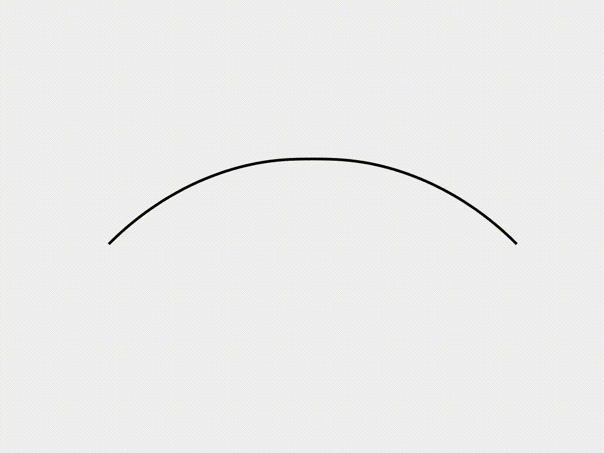

## [Snap-through of the axisymmetric shell](https://github.com/weicheng-huang-mechanics/DDG_Tutorial/tree/main/2d_surface/case_2)

Snap-through is a fascinating nonlinear phenomenon observed in various structures, including shells, arches, and membranes. Understanding and predicting snap-through behavior is crucial in many engineering applications, ranging from micro-switches and actuators to deployable structures and biomedical devices. Understanding these characteristics is crucial for designing and using structures that exhibit snap-through behavior, particularly in applications such as switches, actuators, and energy storage devices. In this case study, we examine the snap-through behavior of an axisymmetric shell subjected to compressive loading. The shell is subject to boundary conditions that allow for large deformations, with the load applied uniformly along its surface. The snap-through phenomenon is characterized by a sudden, large-amplitude shape change as the shell transitions between two stable equilibrium states. This case highlights the ability of the DDG model to accurately capture the nonlinear behavior of the shell and predict the critical load at which the snap-through occurs.

### Simulation Initialization

To initialize the simulation, the following inputs are used:

1. **Geometry and connection:**
   - (i) Nodal positions: the position of the nodes, $$\mathbf{q}(t=0)$$, for a total number of $$N=40$$ nodes, with the axisymmetric shell cap initialized as a hemisphere with a radius $$R=1.0$$ m, and size angle $$0.8 \le \phi_{R} \le \pi/2$$.
   - (ii) Stretching elements: connection of every two consecutive nodes, for a total number of $$N_s=39$$ stretching elements.
   - (iii) Bending elements: connection of every two consecutive edges, for a total number of $$N_b=38$$ bending elements.

2. **Physical parameters:**
   - (i) Young's modulus, $$E = 1.0$$ GPa.
   - (ii) Poisson's ratio, $$\nu = 0.5$$.
   - (iii) Material density, $$\rho = 1000$$ kg/m³.
   - (iv) Shell thickness, $$h = 0.02$$ m.
   - (v) Damping viscosity, $$\mu = 0.1$$.
   - (vi) The overall simulation is static, i.e., $$\mathrm{ifStatic} = 1$$.

3. **Numerical parameters:**
   - (i) Total simulation time, $$T = 6.0$$ s.
   - (ii) Time step size, $$\mathrm{dt} = 0.005$$ s.
   - (iii) Numerical tolerance, $$\mathrm{tol} = 1 \times 10^{-4}$$.
   - (iv) Maximum iterations, $$N_{\mathrm{iter}} = 10$$.

4. **Boundary conditions:**
   - The first two nodes, $$\{\mathbf{x}_{1}, \mathbf{x}_{2}\}$$, from the pole are fixed, while the last node, $$\mathbf{x}_{40}$$, can slide along the $$R$$ axis, thus the constrained array is $$\mathcal{FIX} = [1,2,3,4,80]^{T}$$.

5. **Initial conditions:**
   - (i) Initial position is input from the nodal positions.
   - (ii) Initial velocity is set to zeros.

6. **Loading steps:**
   - The first two nodes are manually moved from top to bottom with a constant speed $$v_z = 0.1$$ m/s.

### Dynamic Rendering
 