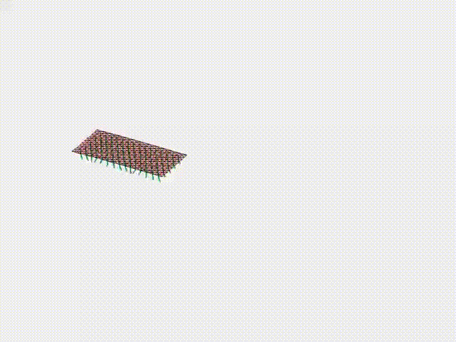
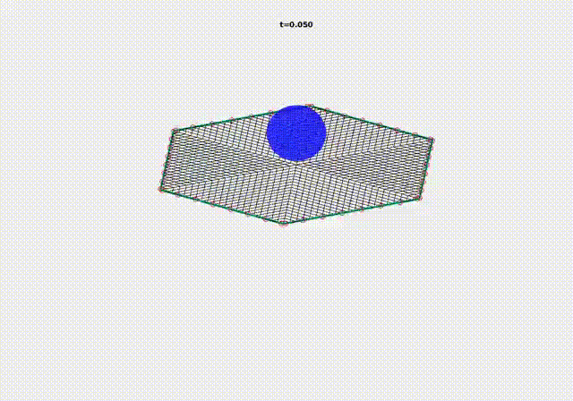

# Large-scale engineering applications

## [Case 1: Growth of helical tendrils](engineering_application_case_1.html)
 

## [Case 2: Soft magnetic cilia robot](engineering_application_case_2.html)
 

## [Case 3: Space net capture system](engineering_application_case_3.html)
 
