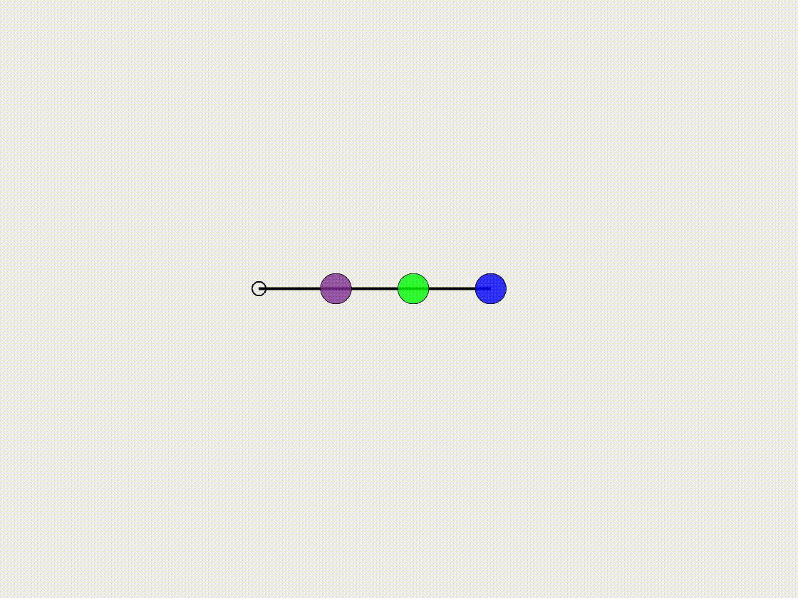

## [Multiple DOF mass-spring-damper system](https://github.com/weicheng-huang-mechanics/DDG_Tutorial/tree/main/mass_spring_system/multiple_DOF)

Next, we examine the forced oscillation behavior of a mass-spring-damper system with multiple degrees of freedom (M-DOFs).

### Simulation Initialization

To initialize the simulation, the following inputs are used:

1. **Geometry and connection:**
   - The positions of the mass array are, $$\mathbf{x} =[1.0, 2.0, 3.0]^{T}$$ m, and the connection is between the two consecutive mass points. Here, we use $$x_{0} = 0.0$$ m to build a connection between the first mass point and the initial point.

2. **Physical parameters:**
   - (i) Mass $${m}_{1} = {m}_{2} = {m}_{3} = 1.0\mathrm{~kg}$$.
   - (ii) Damping viscosity $$ c_{1} = c_{2} = c_{3} = 0.1$$.
   - (iii) Spring stiffness $$k_{1} = 10.0\mathrm{~N/m}$$, $$k_{2} = 20.0\mathrm{~N/m}$$, $$k_{3} = 30.0\mathrm{~N/m}$$.
   - (iv) Natural spring length $$l_{1} = l_{2} = l_{3} = 1.0\mathrm{~m}$$.

3. **Numerical parameters:**
   - (i) Total simulation time $$T=10.0\mathrm{~s}$$.
   - (ii) Time step size $$\mathrm{d}t=0.01\mathrm{~s}$$.
   - (iii) Numerical force tolerance $$\mathrm{tol}=1\times 10^{-6}$$. 

4. **Boundary conditions:**
   - The mass point, $$x_{0}$$, is fixed; all other three mass points are free to move.
     
5. **Initial conditions:**
   - (i) Initial position $$\mathbf{q}(t=0) = [1.0, 2.0, 3.0]^{T} \mathrm{~m}$$.
   - (ii) Initial velocity is set to zeros, $$\mathbf{\dot{q}}(t=0) = [0, 0, 0]^{T} \mathrm{~m/s}$$.
   - 
6. **Loading steps:**
   - The periodic force, $$F_{i} \sin (\omega_{i} t) \; \mathrm{with} \; i \in [1,2,3]$$, is applied into the system, where the magnitudes of the external force are $${F}_{1}^{\rm ext} = 1.0$$ N, $${F}_{2}^{\rm ext} = 2.0$$ N, $${F}_{3}^{\rm ext} =3.0$$ N and the frequencies are $$\omega_{1} = 1.0$$ rad/s, $$\omega_{2} = 2.0$$ rad/s, $$\omega_{3} = 3.0$$ rad/s.

### Dynamic Rendering
 
