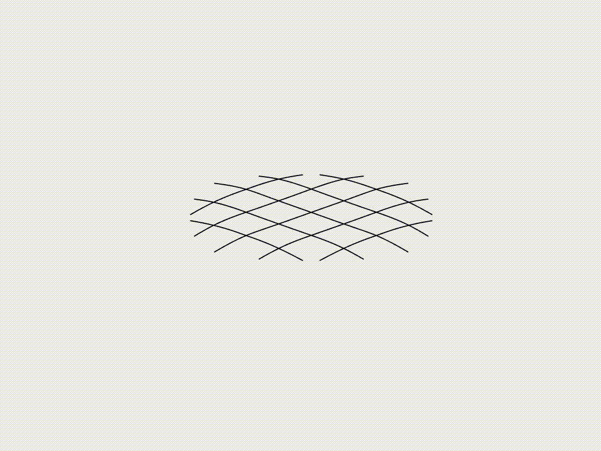

# Net and gridshell

## [Case 1: Flexible net under gravity](rod_network_case_1.html)
 

## [Case 2:  Form-finding of gridshell](rod_network_case_2.html)
 

## [Case 3: Lattice grid under gravity](rod_network_case_3.html)
 

