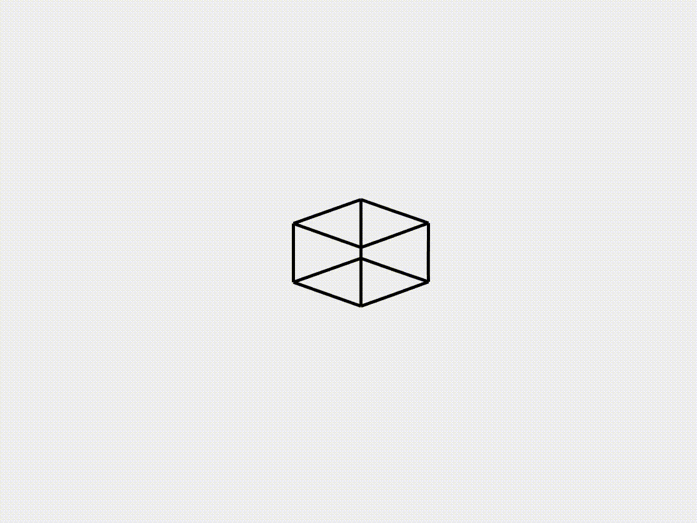

## [Lattice grid under gravity](https://github.com/weicheng-huang-mechanics/DDG_Tutorial/tree/main/rod_network/case_3)

Lattice grid systems are largely used in programmable metamaterials. In this case study, we examine the free oscillation behavior of a lattice grid structure subjected to gravity. The grid is modeled with a fixed corner, allowing it to deform under its self-weight. As the gravitational load acts on the lattice, it undergoes oscillatory motion due to its inherent flexibility. This case highlights the ability of the DDG model to effectively capture the structural flexibility and load-bearing characteristics of lattice frameworks.

### Simulation Initialization

To initialize the simulation, the following inputs are used:

1. **Geometry and connection:**
   - (i) Nodal positions: the position of the nodes, $$\mathbf{q}(t=0)$$, with a total of $$N = 104$$. The lattice is constructed as a cube with a side length of $$L = 1.0$$ m.
   - (ii) Stretching elements: the connections between the nodes, with a total of $$N_s = 108$$.
   - (iii) Bending elements: the connections between the edges, with a total of $$N_b = 120$$.

2. **Physical parameters:**
   - (i) Young's modulus, $$E = 1.0$$ GPa.
   - (ii) Material density, $$\rho = 1000$$ $$\mathrm{kg/m^3}$$.
   - (iii) Cross-sectional radius, $$r_0 = 0.01$$ m, thus $$EI_1 = EI_2 = E \pi r_0^4 / 4$$ and $$GJ = G \pi r_0^4 / 2$$.
   - (iv) Damping viscosity, $$\mu = 0.1$$.
   - (v) Gravity, $$\mathbf{g} = [0.0, 0.0, -1.0]^T$$ $$\mathrm{m/s^2}$$.
   - (vi) The overall simulation is dynamic, i.e., $$\mathrm{ifStatic} = 0$$.

3. **Numerical parameters:**
   - (i) Total simulation time, $$T = 10.0$$ s.
   - (ii) Time step size, $$\mathrm{dt} = 0.01$$ s.
   - (iii) Numerical tolerance, $$\mathrm{tol} = 1 \times 10^{-4}$$.
   - (iv) Maximum iterations, $$N_{\mathrm{iter}} = 10$$.

4. **Boundary conditions:**
   - The nodes at one corner, $$\{ \mathbf{x}_{1}, \mathbf{x}_{2}, \mathbf{x}_{11}, \mathbf{x}_{20} \}$$, as well as the first twisting angle, $$\{ \theta_1 \}$$, are fixed for a clamped-like boundary condition.

5. **Initial conditions:**
   - (i) Initial position is input from the nodal positions.
   - (ii) Initial velocity is set to zeros for all nodes.

6. **Loading steps:**
   - External gravitational force is applied to each node throughout the simulation.

### Dynamic Rendering
 
