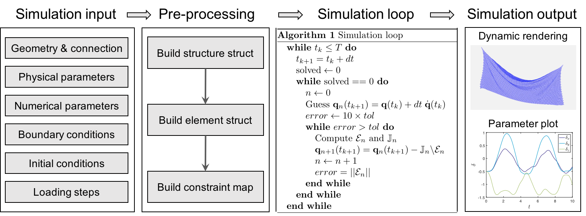

The overall numerical procedure can be divided into four parts: (i) read simulation inputs, (ii) pre-processing, (iii) simulation loop, and (iv) output simulation results.

### Read simulation inputs.

The first step to set up a structural dynamic simulation is to select input data. There are six categories for input information:

1. **Geometry and connection information for a system**, e.g., nodal position, stretching element index, bending element index, triangle element index.
2. **Physical parameters**, e.g., Young's modulus, Poisson ratio, material density, rod radius, plate thickness, gravitational acceleration, and damping viscosity.
3. **Numerical parameters**, such as total simulation time, time step size, numerical tolerance, and maximum iterations.
4. **Boundary conditions**, which are constrained index array and free index array.
5. **Initial conditions**, which are the positions and velocity of DOF at \( t = 0 \).
6. **Loading step**, which loadings are applied sequentially into the system and need to be defined during the time marching loop.

### Pre-processing.

Next, the simulation needs to transfer the input data into several structs:

1. **The system struct**, e.g., rod struct or plate struct, which contains all necessary information for a structure.
2. **The element struct**, which contains information for all local elements.
3. **Mapping**, which defined the relationship between the global DOF vector and the constrained and free DOF vector.

### Simulation loop.

Moving forward, we can perform the time marching scheme for the dynamic simulation, which is uniform for all structural dynamics. We use an implicit Euler method to update the time step and employ Newton's method for numerical optimization within each step.

### Output simulation results.

Finally, the numerical data and the dynamic rendering would be generated during the simulation and will be ready for result analysis. 